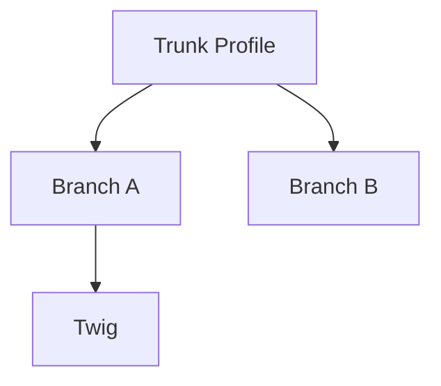

# skyhunters
Generated by [Rojo](https://github.com/rojo-rbx/rojo) 7.5.1.

## Getting Started
To build the place from scratch, use:

```bash
rojo build -o "skyhunters.rbxlx"
```

Next, open `skyhunters.rbxlx` in Roblox Studio and start the Rojo server:

```bash
rojo serve
```

For more help, check out [the Rojo documentation](https://rojo.space/docs).

## Branching

The growth system uses **branch assignments** to control which profiles spawn at each depth.

### Existing depth-driven rules

- **`perDepth`** – list of profile choices for each depth. At depth `n`, the system selects from `perDepth[n]` using weighted chances.
- **`spacingN`** – minimum number of segments between branches at depth `n`.
- **`maxPerDepth`** – maximum branches that may spawn at depth `n`.

Example:

```lua
branchAssignments = {
  trunkProfile = "trunk",
  perDepth = {
    [1] = { {name = "branchA", chance = 0.7}, {name = "branchB", chance = 0.3} },
    [2] = { {name = "twig", chance = 1.0} }
  },
  spacingN = { [1] = 3, [2] = 2 },
  maxPerDepth = { [1] = 4 }
}
```

### Upcoming hierarchical model

Planned work will replace depth arrays with a hierarchical tree where each branch declares its children. Rules cascade from parent to child unless overridden.

```lua
branchAssignments = {
  trunkProfile = "trunk",
  branches = {
    {
      name = "branchA",
      children = {
        { name = "twig", chance = 1.0 }
      }
    },
    { name = "branchB" }
  }
}
```

This model supports complex growth patterns and is intended for future expansion.

### Assignments UI

The plugin's Assignments panel will evolve from a depth-driven layout to a hierarchical tree.

#### Current UI

```mermaid
flowchart TD
    depth1[Depth 1\nperDepth[1]] --> spacing1[spacingN[1]]
    depth1 --> max1[maxPerDepth[1]]
    depth2[Depth 2\nperDepth[2]]
```

#### Planned UI



These diagrams illustrate the transition from depth-based controls to a nested hierarchy.
